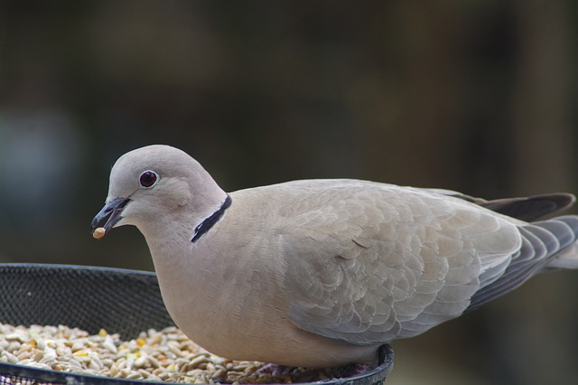

##iOS-usefulinformation-zh_CN

>Tag v1.0

斑鸠 [百科](http://baike.baidu.com/subview/76660/5087567.htm)

## 参与交流

欢迎大家将珍藏已久的资料共享出来，您可以：

* 使用 [Issues](https://github.com/lcepy/ios-programming-books-zh_CN/issues) 以及 Pull Request

iOS开发者博客，您可以：

* 使用 [iOSBlogCN](https://github.com/tangqiaoboy/iOSBlogCN)添加或者订阅

##访问

* [学习iOS之前快速预览](学习iOS之前的快速预览)
* [语言学习](语言)
* [视频学习](视频)
* [设计学习](设计)
* [项目收集](项目收集)
* [访问社区](社区)
* [Swift优秀文章](Swift优秀文章)
* [Objective-C优秀文章](Objective-C优秀文章)
* [学习路线](http://www.cocoachina.com/special/fornew.html)

